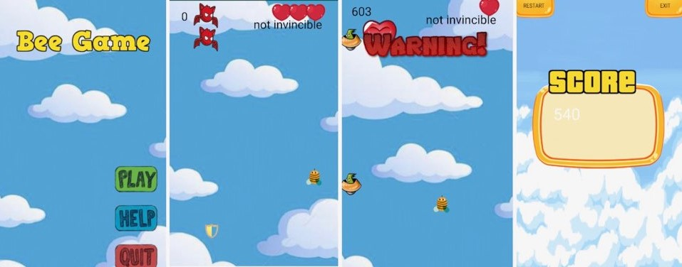

# BeeGame-Assignment
<h2><a name = "Title1"> Game Overview </a></h2>

 This is an assginment for the course COMP2120 at Australian National University. 
The objective of this game is to stay alive as long as possible avoiding enemies attacks. There are no limitation in time but you have three lives (called hp) before you die.
 

<h3> Technologies </h3>

   Android Studio, Java, PHP (user login)

<h3> Contributors </h3>

  Minju Kang, Soobin Lee

